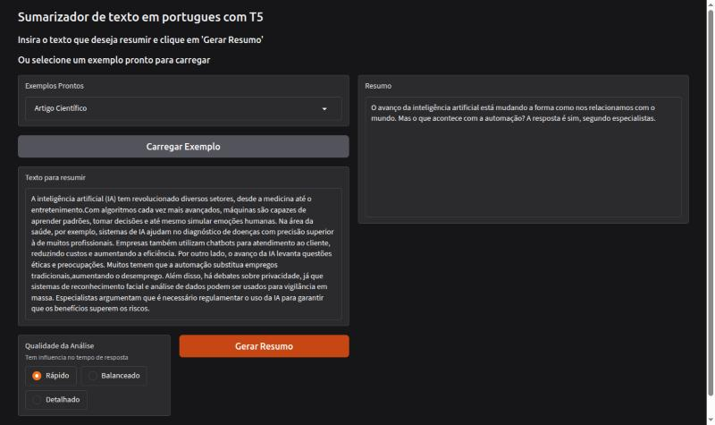

# Toolongdidntread

O nome vem de *too long; didn't read* (TL;DR): o texto é tão longo que ninguém leu, então o app resume por você.

Uma aplicação interativa de **sumarização abstrativa** de textos em **Português Brasileiro**, baseada no modelo [PTT5-base-summ-xlsum](https://huggingface.co/recogna-nlp/ptt5-base-summ-xlsum) da Hugging Face.



---

## Funcionalidades

- Interface web com [Gradio](https://gradio.app/) para inserir o texto e ver o resumo
- Três níveis de qualidade da análise: **Rápido**, **Balanceado** e **Detalhado**
- Pré-processamento: remoção de URLs e emojis e dicionário de abreviações (`data/abrev.json`)
- Quatro textos de exemplo (`data/texts.json`) para teste rápido na interface
- Modelo fine-tuned para sumarização em Português Brasileiro, executado em CPU

---

## Como rodar

```bash
python -m venv venv
source venv/bin/activate        # no Windows: venv\Scripts\activate
pip install -r requirements.txt
python -m app.main              # execute na raiz do projeto
```

A interface abre em `http://127.0.0.1:7860`. Na primeira execução, o modelo e o tokenizer (cerca de 850 MB) são baixados do Hugging Face e ficam em cache. Testado em CPU com Python 3.14, PyTorch 2.14, transformers 5.18 e Gradio 6.29.

> **Atenção:** `app/main.py` inicia o Gradio com `share=True`, que cria um **link público temporário** para a sua máquina. Para usar só localmente, remova esse argumento.

> **Dica:** o `requirements.txt` instala o PyTorch padrão do PyPI. Para uma versão apenas CPU (bem menor), instale antes com `pip install torch --index-url https://download.pytorch.org/whl/cpu`.

---

## Níveis de qualidade

Cada nível ajusta a geração do resumo (`core/summarizer.py`). Os tempos foram medidos em CPU, com textos de 85 a 250 palavras:

| Nível | Tamanho do resumo (tokens) | Beams | Tempo aproximado |
|---|---|---|---|
| Rápido | 30 a 150 | 2 | 2 a 4 s |
| Balanceado | 50 a 200 | 4 | 4 a 6 s |
| Detalhado | 80 a 256 | 6 | 8 a 14 s |

O texto de entrada deve ter pelo menos 30 palavras e é truncado em 512 tokens.

---

## Limitações

- **O modelo pode inventar informações.** Nos testes, os níveis Balanceado e Detalhado incluíram nomes, veículos de imprensa e datas que não estavam no texto original. Confira o resumo contra o texto antes de usá-lo.
- **O dicionário de abreviações é amplo e também altera palavras comuns**: gírias como "vc", "tb" e "blz" são expandidas, mas entradas como "ia", "povo", "suave" e "amo" também mudam textos formais (por exemplo, "o povo" vira "o pessoal"). Revise `data/abrev.json` conforme o tipo de texto.
- O desempenho em GPU não foi testado.

---

## Estrutura

```
app/    interface Gradio (interface.py) e ponto de entrada (main.py)
core/   carregamento do modelo, sumarização e pré-processamento
data/   abrev.json (abreviações) e texts.json (exemplos)
docs/   imagem usada no README
```

---

## Referência do Modelo

@InProceedings{ptt5summ_bracis,
  author="Paiola, Pedro H.
    and de Rosa, Gustavo H.
    and Papa, Jo{\~a}o P.",
  editor="Xavier-Junior, Jo{\~a}o Carlos
    and Rios, Ricardo Ara{\'u}jo",
  title="Deep Learning-Based Abstractive Summarization for Brazilian Portuguese Texts",
  booktitle="BRACIS 2022: Intelligent Systems",
  year="2022",
  publisher="Springer International Publishing",
  address="Cham",
  pages="479--493",
  isbn="978-3-031-21689-3"
}